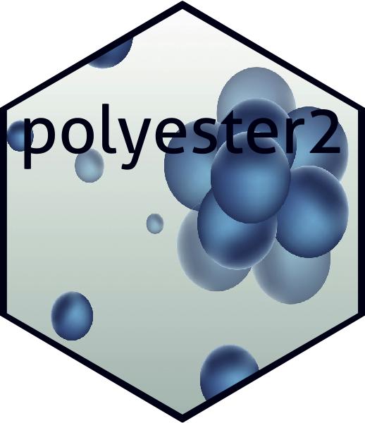

<!-- README.md is generated from README.Rmd. Please edit that file -->

```{r, include = FALSE}
knitr::opts_chunk$set(
  collapse = TRUE,
  comment = "#>",
  fig.path = "man/figures/README-",
  out.width = "100%"
)
```


# polyester2   

<!-- badges: start -->
[](https://www.tidyverse.org/lifecycle/#experimental)
[](https://CRAN.R-project.org/package=polyester2)
<!-- badges: end -->

This package creates a simulated patient population using Synthea and ETL it into the OMOP Common Data Model.  


## Installation

You can install polyester2 with:

``` r
devtools::install_github("meerapatelmd/polyester2")
```


## Example

Artificial data is first generated using Synthea by:

```{r example,echo=TRUE,eval=FALSE}
library(polyester2)
run_synthea(populationSize = 1000,
            state = "California",
            city = "Los Angeles")
```

The output data is located in a subdirectory `synthea_output` folder in the working directory named by timestamp. This way, multiple rounds of Synthea can be executed and saved without being overwritten.  


The native Synthea output can be ETL'd into the OMOP CDM:  

```{r example2,echo=TRUE,eval=FALSE}
library(polyester2)
etl_to_omop(user = "root",
            password = "candycane",
            server = "localhost/taffeta",
            port = 5432,
            omop_cdm_schema = "omop",
            synthea_schema = "synthea",
            path_to_synthea_csvs = "synthea_output/2020-11-14 11:00:00:00/csv",
            path_to_omop_vocab_csvs = "~/athena_vocabulary")
```

The function will fail to execute if a connection cannot be made using the credentials provided or if the schemas do not exist.  
